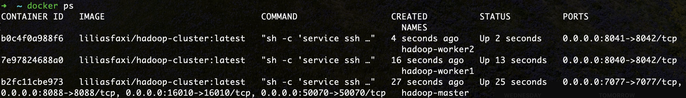
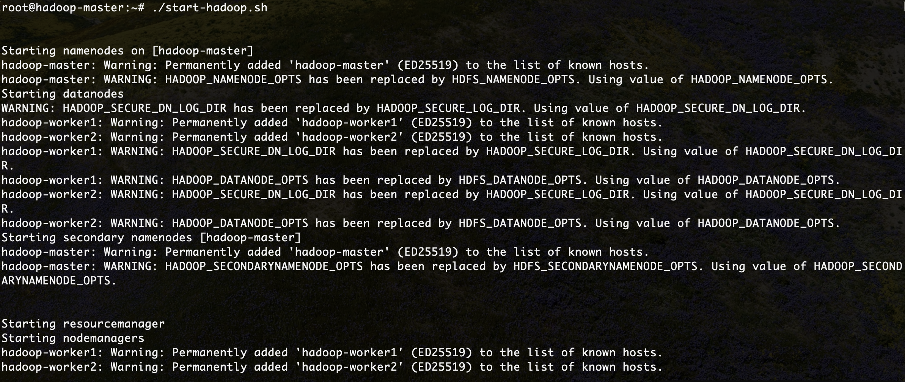
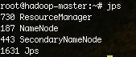
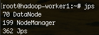
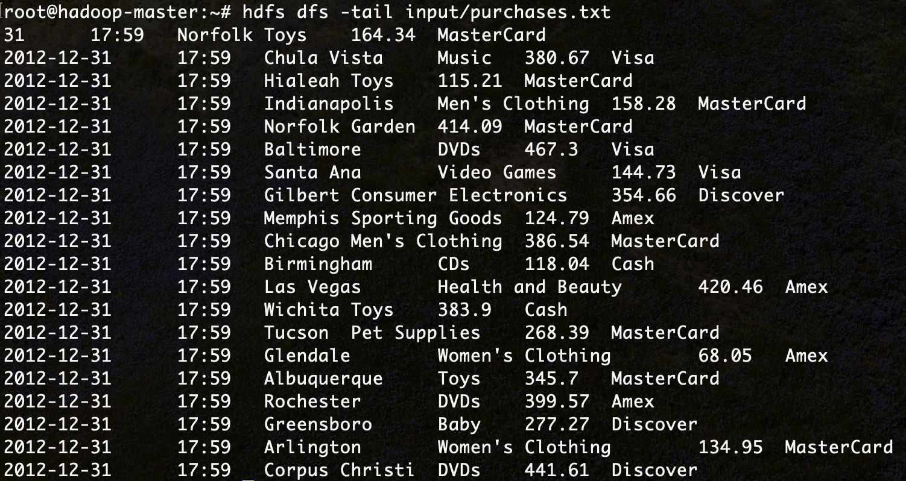
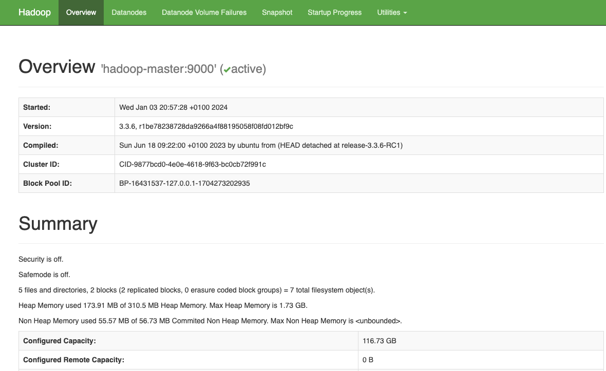
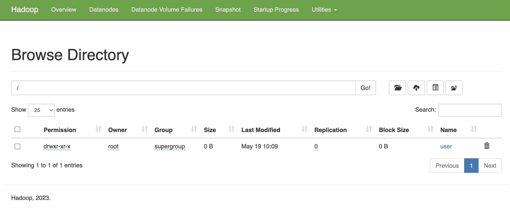
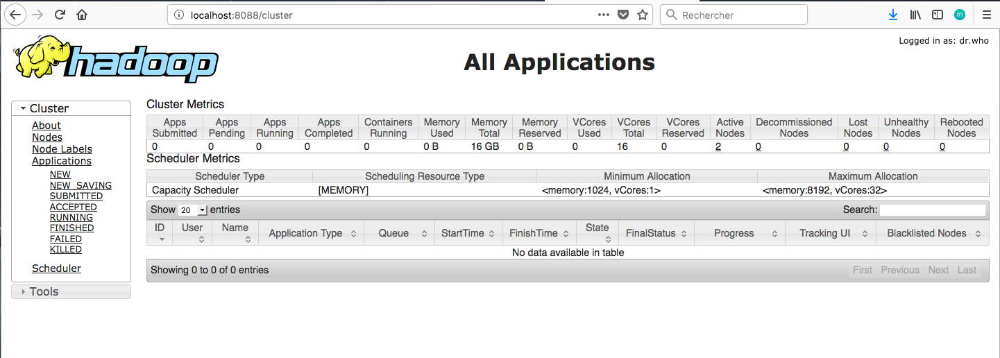

<center></center>

## Objectifs
Initiation au framework hadoop et manipulation de HDFS, utilisation de docker pour lancer un cluster hadoop de 3 noeuds.


## Hadoop
### Présentation
[Apache Hadoop](hadoop.apache.org) est un framework open-source pour stocker et traiter les données volumineuses sur un cluster. Il est utilisé par un grand nombre de contributeurs et utilisateurs. Il a une licence Apache 2.0.

<center></center>


### Hadoop et Docker
Pour déployer le framework Hadoop, nous allons utiliser des contenaires [Docker](https://www.docker.com/). L'utilisation des contenaires va garantir la consistance entre les environnements de développement et permettra de réduire considérablement la complexité de configuration des machines (dans le cas d'un accès natif) ainsi que la lourdeur d'exécution (si on opte pour l'utilisation d'une machine virtuelle).


### Installation
Nous allons utiliser trois contenaires représentant respectivement un noeud maître (Namenode) et deux noeuds workers (Datanodes).

Vous devez pour cela avoir installé docker sur votre machine, et l'avoir correctement configuré. Ensuite, ouvrir la ligne de commande, et taper les instructions suivantes:

1. Télécharger l'image docker uploadée sur dockerhub:
``` Bash
docker pull liliasfaxi/my-hadoop-spark:latest
```
1. Créer les trois contenaires à partir de l'image téléchargée. Pour cela:
   
    2.1. Créer un réseau qui permettra de relier les trois contenaires:
    ``` Bash
    docker network create --driver=bridge hadoop
    ```
    2.2. Créer et lancer les trois contenaires (les instructions -p permettent de faire un mapping entre les ports de la machine hôte et ceux du contenaire):

    * Contenaire Master: 
    ```Bash
    docker run -itd --net=hadoop -p 9870:9870 -p 8088:8088 -p 7077:7077 -p 16010:16010 --name hadoop-master --hostname hadoop-master liliasfaxi/my-hadoop-spark:latest
    ```

    * Contenaire Worker 1
    ```Bash
    docker run -itd -p 8040:8042 --net=hadoop --name hadoop-worker1 --hostname hadoop-worker1 liliasfaxi/my-hadoop-spark:latest
    ```

    * Contenaire Worker 2
    ```Bash
    docker run -itd -p 8041:8042 --net=hadoop --name hadoop-worker2 --hostname hadoop-worker2 liliasfaxi/my-hadoop-spark:latest
    ```
    
    2.3. Vérifier que les trois contenaires tournent bien en lançant la commande ```docker ps```. Un résultat semblable au suivant devra s'afficher:
      
      <center></center>

2. Entrer dans le contenaire master pour commencer à l'utiliser.

    ```Bash
    docker exec -it hadoop-master bash
    ```

Le résultat de cette exécution sera le suivant:

```Bash
root@hadoop-master:~#
```

Vous vous retrouverez dans le shell du namenode, et vous pourrez ainsi manipuler le cluster à votre guise. La première chose à faire, une fois dans le contenaire, est de lancer hadoop et yarn. Un script est fourni pour cela, appelé ```start-hadoop.sh```. Lancer ce script.

```Bash
./start-hadoop.sh
```

Le résultat devra ressembler à ce qui suit:


Vous pouvez visualiser les processus de HDFS et YARN qui tournent sur votre système en lançant la commande ```jps```, qui permet de lister les machines virtuelles Java (JVM) intrumentée sur le système cible. Le résultat que vous devriez obtenir est le suivant:

<center>

</center>

Exécuter la même instruction sur une machine worker donnera le résultat suivant:

<center>

</center>

On peut voir que les démons Namenode et Secondary Namenode de HDFS, ainsi que le Resource Manager de YARN tournent sur le master, alors que les démons Datanode de HDFS et NodeManager de YARN tournent sur le worker.


### Premiers pas avec Hadoop
Toutes les commandes interagissant avec le système HDFS commencent par ```hdfs dfs```. Ensuite, les options rajoutées sont très largement inspirées des commandes Unix standard.

  - Créer un répertoire dans HDFS, appelé _input_. Pour cela, taper:
```bash
hdfs dfs -mkdir -p input
```

??? bug "En cas d'erreur: _No such file or directory_"
    Si pour une raison ou une autre, vous n'arrivez pas à créer le répertoire _input_, avec un message ressemblant à ceci: ```ls: `.': No such file or directory```, veiller à construire l'arborescence de l'utilisateur principal (root), comme suit:

    ``` hdfs dfs -mkdir -p /user/root```

  - Nous allons utiliser le fichier  [purchases.txt](https://github.com/CodeMangler/udacity-hadoop-course/blob/ec6bbb839bdc6e701f802c523497fef4e1c206d0/Datasets/purchases.txt.gz) pour manipuler hdfs. 
  - Commencer par télécharger le fichier sur votre propre machine, le décompresser, puis par le charger dans le contenaire ```hadoop-master``` avec la commande suivante (à exécuter dans le terminal de votre machine hôte):
  ```Bash
  docker cp purchases.txt hadoop-master:/root/purchases.txt
  ```
  - À partir du contenaire master, charger le fichier purchases dans le répertoire input (de HDFS) que vous avez créé:
  ```Bash
  hdfs dfs -put purchases.txt input
  ```
  - Pour afficher le contenu du répertoire _input_, la commande est:
  ```bash
  hdfs dfs -ls input
  ```
  - Pour afficher les dernières lignes du fichier purchases:
  ```bash
  hdfs dfs -tail input/purchases.txt
  ```

  Le résultat suivant va donc s'afficher:
    <center></center>


Nous présentons dans le tableau suivant les commandes les plus utilisées pour manipuler les fichiers dans HDFS:

|Instruction|Fonctionnalité|
|---------|-------------------------------------------------------------|
| ```hdfs dfs –ls``` | Afficher le contenu du répertoire racine |
| ```hdfs dfs –put file.txt``` | Upload un fichier dans hadoop (à partir du répertoire courant de votre disque local) |
| ```hdfs dfs –get file.txt``` | Download un fichier à partir de hadoop sur votre disque local |
| ```hdfs dfs –tail file.txt``` | Lire les dernières lignes du fichier   |
| ```hdfs dfs –cat file.txt``` | Affiche tout le contenu du fichier  |
| ```hdfs dfs –mv file.txt newfile.txt``` |  Renommer (ou déplacer) le fichier  |
| ```hdfs dfs –rm newfile.txt``` | Supprimer le fichier  |
| ```hdfs dfs –mkdir myinput``` | Créer un répertoire |


### Interfaces web pour Hadoop

Hadoop offre plusieurs interfaces web pour pouvoir observer le comportement de ses différentes composantes. Il est possible d'afficher ces pages directement sur notre machine hôte, et ce grâce à l'utilisation de l'option -p de la commande ```docker run```. En effet, cette option permet de publier un port du contenaire sur la machine hôte. Pour pouvoir publier tous les ports exposés, vous pouvez lancer votre contenaire en utilisant l'option ```-P```.

En regardant la commande ```docker run``` utilisée plus haut, vous verrez que deux ports de la machine maître ont été exposés:

  * Le port **9870**: qui permet d'afficher les informations de votre namenode.
  * Le port **8088**: qui permet d'afficher les informations du resource manager de Yarn et visualiser le comportement des différents jobs.

Une fois votre cluster lancé et hadoop démarré et prêt à l'emploi, vous pouvez, sur votre navigateur préféré de votre machine hôte, aller à : http://localhost:9870. Vous obtiendrez le résultat suivant:



À partir de cette interface, il est possible de voir le contenu de votre système de fichier, en cliquant sur `Utilities -> Browse the File System`. L'interface affichée sera la suivante:



Vous pouvez également visualiser l'avancement et les résultats de vos Jobs (Map Reduce ou autre) en allant à l'adresse: http://localhost:8088.



