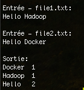
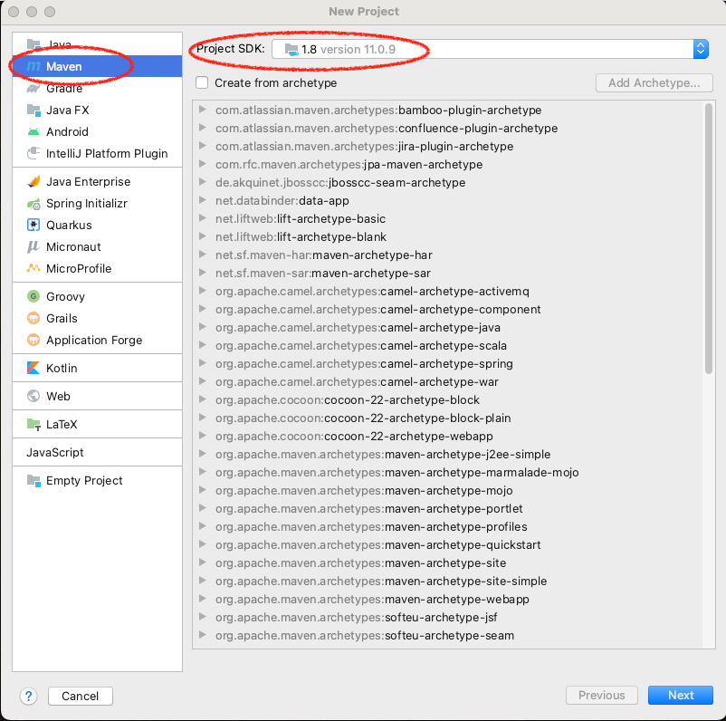
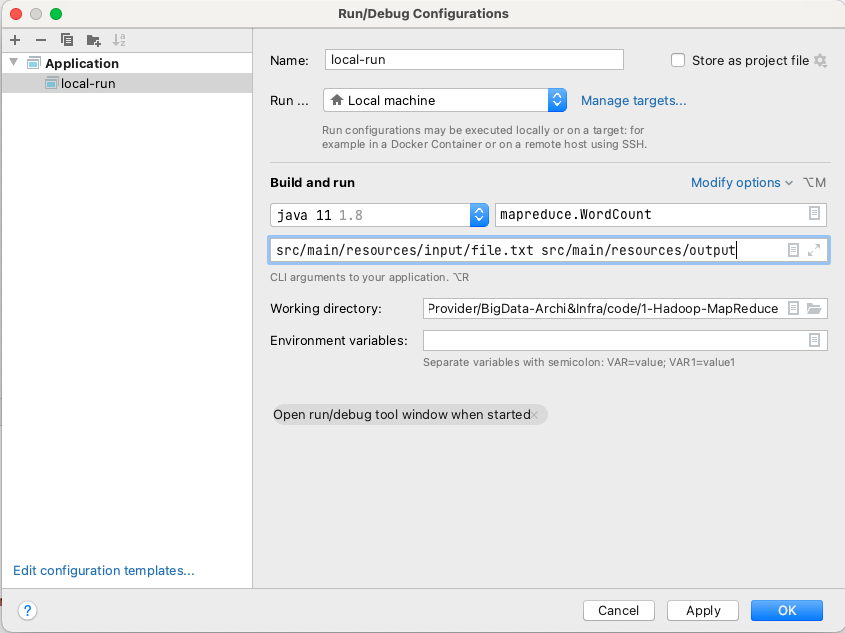
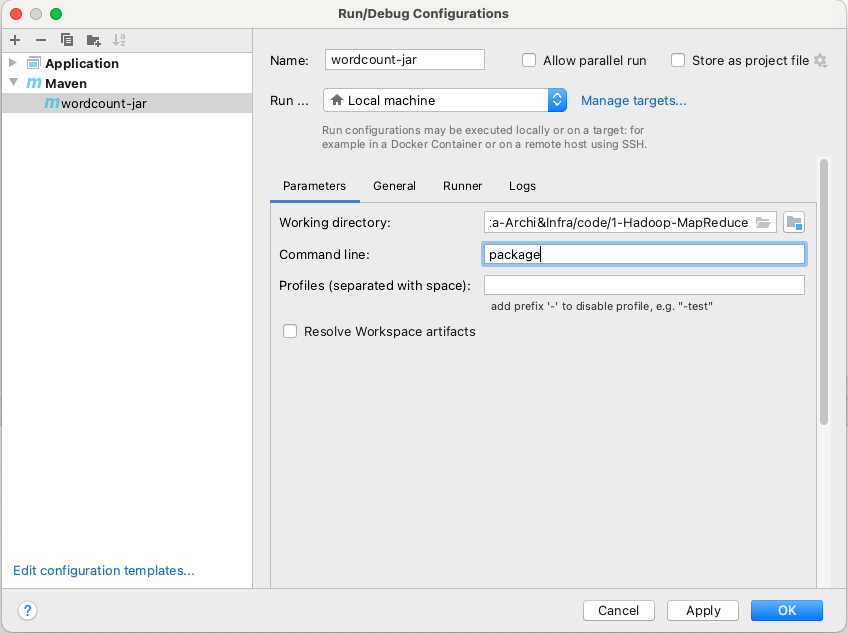
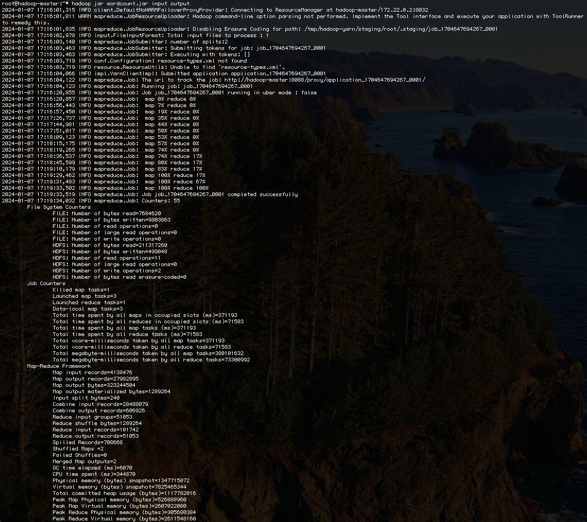
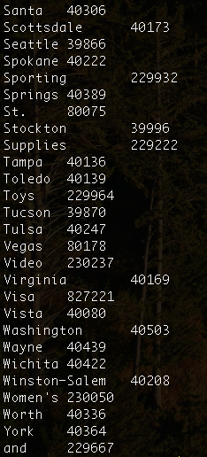
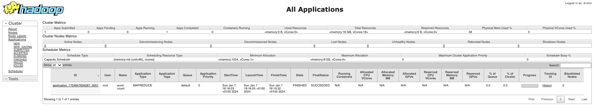
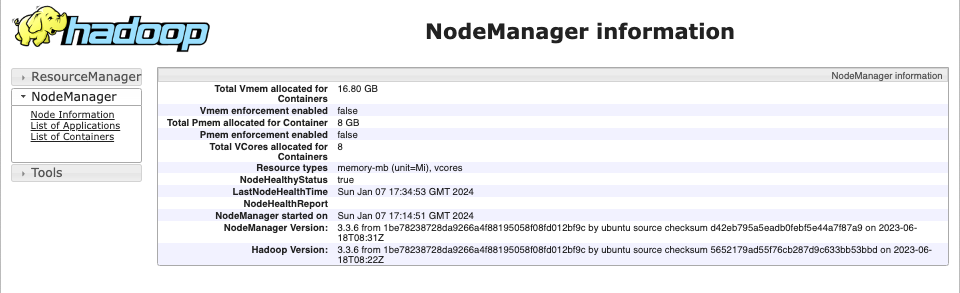

<center></center>

## Objectifs
Initiation à Hadoop Map Reduce. Utilisation d'un code prédéfini et manipulation de l'API avec Java.


## Présentation de Map Reduce
Un Job Map-Reduce se compose principalement de deux types de programmes:

  - **Mappers** : permettent d’extraire les données nécessaires sous forme de clef/valeur, pour pouvoir ensuite les trier selon la clef
  - **Reducers** : prennent un ensemble de données triées selon leur clef, et effectuent le traitement nécessaire sur ces données (somme, moyenne, total...)

## Wordcount
Nous allons tester un programme MapReduce grâce à un exemple très simple, le _WordCount_, l'équivalent du _HelloWorld_ pour les applications de traitement de données. Le Wordcount permet de calculer le nombre de mots dans un fichier donné, en décomposant le calcul en deux étapes:

  * L'étape de _Mapping_, qui permet de découper le texte en mots et de délivrer en sortie un flux textuel, où chaque ligne contient le mot trouvé, suivi de la valeur 1 (pour dire que le mot a été trouvé une fois)
  * L'étape de _Reducing_, qui permet de faire la somme des 1 pour chaque mot, pour trouver le nombre total d'occurrences de ce mot dans le texte.

### Tester Wordcount
Nous commençons par tester la bonne exécution d'un code Map Reduce prédéfini, en faisant appel à un exemple de wordcount fourni par le framework Hadoop. Pour cela:

  * Commencer par créer un répertoire test dans votre contenaire master:
  ```bash
  mkdir test
  ```
  * Créer deux fichiers `file1` et `file2` dans `test` contenant chacun une ligne de texte, comme suit:
  ```bash
  echo "Hello Docker" >test/file2.txt
  echo "Hello Hadoop" >test/file1.txt
  ```
  * Créer un répertoire `test` dans HDFS, et y charger les deux fichiers:
  ```bash
  hdfs dfs -mkdir test
  hdfs dfs -put ./test/* test
  ```
  * Lancer le job Wordcount en faisant appel au fichier jar prédéfini de Hadoop. Le résultat sera enregistré dans le répertoire `outest` de HDFS:
  ```bash
  hadoop jar $HADOOP_HOME/share/hadoop/mapreduce/sources/hadoop-mapreduce-examples-3.3.6-sources.jar org.apache.hadoop.examples.WordCount test outest
  ```
  * Le job va se lancer, en affichant plusieurs lignes sur le terminal. On pourra visualiser le résultat en tapant les lignes suivantes:
  ```bash
  # Afficher les fichiers en entrée
  echo -e "\nEntrée - file1.txt:"
  hdfs dfs -cat test/file1.txt

  echo -e "\nEntrée - file2.txt:"
  hdfs dfs -cat test/file2.txt

  # afficher le résultat 
  echo -e "\nSortie:"
  hdfs dfs -cat outest/part-r-00000
  ```
  Le résultat sera le suivant:
  <center>
  
  </center> 

### Wordcount avec Java
Commençons par créer un projet Maven dans IntelliJ IDEA. **Nous utiliserons dans notre cas JDK 1.8**.

??? info "Version de JDK"
    Ceci n'est pas une suggestion: l'utilisation d'une autre version que 1.8 provoquera des erreurs sans fin. Hadoop est compilé avec cette version de Java, connue pour sa stabilité. 

Pour créer un projet Maven dans IntelliJIDEA: 

  * Créer un nouveau projet en cliquant sur `Maven` dans la fenêtre de gauche, et en choisissant le SDK 1.8 dans la fenêtre déroulante.

  * Nommer votre projet `1-Hadoop-MapReduce`, et définir les valeurs suivantes dans la partie `Artifact Coordinates`:
    - **GroupId**: hadoop.mapreduce
    - **ArtifactId**: wordcount
    - **Version**: 1
  * Ouvrir le fichier _pom.xml_ automatiquement créé, et remplacer son contenu par le code suivant:

```xml
  <?xml version="1.0" encoding="UTF-8"?>
<project xmlns="http://maven.apache.org/POM/4.0.0"
         xmlns:xsi="http://www.w3.org/2001/XMLSchema-instance"
         xsi:schemaLocation="http://maven.apache.org/POM/4.0.0 http://maven.apache.org/xsd/maven-4.0.0.xsd">
    <modelVersion>4.0.0</modelVersion>

    <groupId>hadoop.mapreduce</groupId>
    <artifactId>wordcount</artifactId>
    <version>1</version>

    <properties>
        <maven.compiler.source>1.8</maven.compiler.source>
        <maven.compiler.target>1.8</maven.compiler.target>
    </properties>

    <dependencies>
        <!-- https://mvnrepository.com/artifact/org.apache.hadoop/hadoop-common -->
        <dependency>
            <groupId>org.apache.hadoop</groupId>
            <artifactId>hadoop-common</artifactId>
            <version>3.3.6</version>
        </dependency>
        <!-- https://mvnrepository.com/artifact/org.apache.hadoop/hadoop-mapreduce-client-core -->
        <dependency>
            <groupId>org.apache.hadoop</groupId>
            <artifactId>hadoop-mapreduce-client-core</artifactId>
            <version>3.3.6</version>
        </dependency>
        <!-- https://mvnrepository.com/artifact/org.apache.hadoop/hadoop-hdfs -->
        <dependency>
            <groupId>org.apache.hadoop</groupId>
            <artifactId>hadoop-hdfs</artifactId>
            <version>3.3.6</version>
        </dependency>
        <!-- https://mvnrepository.com/artifact/org.apache.hadoop/hadoop-mapreduce-client-common -->
        <dependency>
            <groupId>org.apache.hadoop</groupId>
            <artifactId>hadoop-mapreduce-client-common</artifactId>
            <version>3.3.6</version>
        </dependency>
        <!-- https://mvnrepository.com/artifact/org.apache.hadoop/hadoop-mapreduce-client-jobclient -->
        <dependency>
            <groupId>org.apache.hadoop</groupId>
            <artifactId>hadoop-mapreduce-client-jobclient</artifactId>
            <version>3.3.6</version>
        </dependency>

    </dependencies>
  </project>
```

  * Créer un package _mapreduce_ sous le répertoire _src/main/java/_
  * Créer la classe _TokenizerMapper_, contenant ce code:

```java
  package mapreduce;

  import org.apache.hadoop.io.IntWritable;
  import org.apache.hadoop.io.Text;
  import org.apache.hadoop.mapreduce.Mapper;

  import java.io.IOException;
  import java.util.StringTokenizer;

  public class TokenizerMapper
        extends Mapper<Object, Text, Text, IntWritable>{

    private final static IntWritable one = new IntWritable(1);
    private Text word = new Text();

    public void map(Object key, Text value, Mapper.Context context
    ) throws IOException, InterruptedException {
        StringTokenizer itr = new StringTokenizer(value.toString());
        while (itr.hasMoreTokens()) {
            word.set(itr.nextToken());
            context.write(word, one);
        }
    }
  }
```
  La méthode `map` manipule une ligne d'entrée (_value_), commence par la diviser en mots grâce à la classe _StringTokenizer_, ensuite, pour chaque mot, elle renvoie en sortie (dans l'object global _context_) ce mot accompagné de la valeur **1**.

  * Créer la classe _IntSumReducer_:

```java
package mapreduce;

import org.apache.hadoop.io.IntWritable;
import org.apache.hadoop.io.Text;
import org.apache.hadoop.mapreduce.Reducer;

import java.io.IOException;

public class IntSumReducer
        extends Reducer<Text,IntWritable,Text,IntWritable> {

    private IntWritable result = new IntWritable();

    public void reduce(Text key, Iterable<IntWritable> values,
                       Context context
    ) throws IOException, InterruptedException {
        int sum = 0;
        for (IntWritable val : values) {
            System.out.println("value: "+val.get());
            sum += val.get();
        }
        System.out.println("--> Sum = "+sum);
        result.set(sum);
        context.write(key, result);
    }
}

```
La méthode `reduce` reçoit en entrée un couple clef/valeurs. En effet, Hadoop se charge, en arrière plan dans son étape de _Shuffle and Sort_ de regrouper les éléments en sortie du Mapper, ayant la même clef, ainsi que leurs différentes valeurs. Par exemple, si le mot Bonjour existe sur deux lignes différentes en sortie des Mappers, il arrive au reducer sous la forme : `Bonjour 1 1`. 
Ce reducer se charge alors de parcourir les valeurs associés à la même clef, puis de faire leurs sommes.

  * Enfin, créer la classe principale _WordCount_:

```java
package mapreduce;

import org.apache.hadoop.conf.Configuration;
import org.apache.hadoop.fs.Path;
import org.apache.hadoop.io.IntWritable;
import org.apache.hadoop.io.Text;
import org.apache.hadoop.mapreduce.Job;
import org.apache.hadoop.mapreduce.lib.input.FileInputFormat;
import org.apache.hadoop.mapreduce.lib.output.FileOutputFormat;

public class WordCount {
    public static void main(String[] args) throws Exception {
        Configuration conf = new Configuration();
        Job job = Job.getInstance(conf, "word count");
        job.setJarByClass(WordCount.class);
        job.setMapperClass(TokenizerMapper.class);
        job.setCombinerClass(IntSumReducer.class);
        job.setReducerClass(IntSumReducer.class);
        job.setOutputKeyClass(Text.class);
        job.setOutputValueClass(IntWritable.class);
        FileInputFormat.addInputPath(job, new Path(args[0]));
        FileOutputFormat.setOutputPath(job, new Path(args[1]));
        System.exit(job.waitForCompletion(true) ? 0 : 1);
    }
}

```
Cette classe permet de lancer le Job en donnant les différentes configurations. Par exemple, elle déclare la classe _IntSumReducer_ comme étant à la fois le reducer et le combiner du Job Map Reduce.

#### Tester Map Reduce en local
Dans votre projet sur IntelliJ:

  * Créer un répertoire _input_ sous le répertoire _resources_ de votre projet.
  * Créer un fichier de test: _file.txt_ dans lequel vous insèrerez les deux lignes:
```
Hello Wordcount!
Hello Hadoop!
```
  * Nous allons maintenant définir des arguments de la méthode Main: le fichier en entrée sur lequel Map reduce va travailler, et le répertoire en sortie dans lequel le résultat sera stocké. Pour cela:
    * Cliquer sur le bouton _Add Configuration..._ qui se trouve en haut à droite de votre fenêtre principale dans IntelliJ, ou alors aller vers le menu _Run -> Edit Configurations..._
    * Cliquer sur le bouton + en haut à gauche de la fenêtre qui vient de s'ouvrir. 
    * Choisir _Application_ dans la liste.
    * Nommer votre configuration _local-run_
    * Dans la partie _Build and run_, prenez soin de choisir la version 1.8 de Java
    * Choisir mapreduce.WordCount comme étant la *Main Class* à exécuter.
    * Dans le champ _Program arguments_, saisir les arguments suivants: `src/main/resources/input/file.txt src/main/resources/output`. Nous indiquons ainsi que le répertoire output est le répertoire de sortie de notre exécution. ATTENTION, output ne doit pas exister avant le lancement du job.
    * Voici la fenêtre de configuration finale:
  
  * Lancer le programme. Un répertoire _output_ sera créé dans le répertoire _resources_, contenant notamment un fichier _part-r-00000_, dont le contenu devrait être le suivant:
  
  ```
  Hadoop!	1
  Hello	2
  Wordcount!	1
  ```


???bug "Pour les utilisateurs.trices de Windows"
    Les utilisateurs.trices de Windows vont certainement rencontrer l'erreur suivante: `HADOOP_HOME and hadoop.home.dir are unset.`.
    Pour y remédier, suivre les étapes suivantes:
      
      * Télécharger de ce [projet](https://github.com/cdarlint/winutils) le répertoire correspondant à la version de Hadoop utilisée (ici 3.3.6) quelque part sur votre machine. Appelons ce quelque part _REP_.
      * Créer la variable d'environnement HADOOP_HOME aux variables système, et y associer la valeur _REP_
      * Ajouter à la variable d'environnement PATH le répertoire `$HADOOP_HOME/bin`
    Sinon, vous pouvez toujours utiliser Linux.. 


#### Lancer Map Reduce sur le cluster
Dans votre projet IntelliJ:

  * Pour pouvoir encapsuler toutes les dépendances du projet dans le fichier JAR à exporter, ajouter les lignes suivantes dans le fichier _pom.xml_ de votre projet, juste après les dépendances:

  
  ```xml hl_lines="10"
  <build>
    <plugins>
      <plugin>
        <groupId>org.apache.maven.plugins</groupId>
        <artifactId>maven-assembly-plugin</artifactId>
        <version>3.6.0</version> <!-- Use latest version -->
        <configuration>
          <archive>
            <manifest>
              <mainClass>mapreduce.WordCount</mainClass>
            </manifest>
          </archive>
          <descriptorRefs>
            <descriptorRef>jar-with-dependencies</descriptorRef>
          </descriptorRefs>
        </configuration>
        <executions>
          <execution>
            <id>make-assembly</id> <!-- this is used for inheritance merges -->
            <phase>package</phase> <!-- bind to the packaging phase -->
            <goals>
              <goal>single</goal>
            </goals>
          </execution>
        </executions>
      </plugin>
    </plugins>
  </build>
  ```

  * Créer une nouvelle configuration d'exécution, cette fois-ci de type Maven, qu'on appellera _wordcount-jar_, et qui va exécuter la commande _package_ pour créer un nouveau fichier jar exécutable à partir de notre code. La configuration sera comme suit:
  
  * Lancer la configuration. Un fichier _wordcount-1-jar-with-dependencies.jar_ sera créé sous le répertoire _target_ du projet.
  * Copier le fichier jar créé dans le contenaire master. Pour cela:
    - Ouvrir le terminal sur le répertoire du projet. Cela peut être fait avec IntelliJ en ouvrant directement un terminal.
    - Taper la commande suivante:
    ```bash
    docker cp target/wordcount-1-jar-with-dependencies.jar hadoop-master:/root/wordcount.jar
    ```

  * Revenir au shell du contenaire master, et lancer le job map reduce avec cette commande:
  
```bash
hadoop jar wordcount.jar input output
```

Le Job sera lancé sur le fichier _purchases.txt_ que vous aviez préalablement chargé dans le répertoire _input_ de HDFS. Une fois le Job terminé, un répertoire _output_ sera créé. Si tout se passe bien, vous obtiendrez un affichage ressemblant au suivant:


En affichant les dernières lignes du fichier généré _output/part-r-00000_, avec ```hdfs dfs -tail output/part-r-00000```, vous obtiendrez l'affichage suivant:



Il vous est possible de monitorer vos Jobs Map Reduce, en allant à la page: ```http://localhost:8088```. Vous trouverez votre Job dans la liste des applications comme suit:



Il est également possible de voir le comportement des noeuds workers, en allant à l'adresse: ```http://localhost:8041``` pour _worker1_, et ```http://localhost:8042``` pour _worker2_. Vous obtiendrez ce qui suit:


