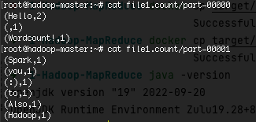

<center></center>


## Objectifs
Manipulation de Spark Shell avec Scala pour lancer un traitement sur des données sur HDFS. 


## Spark
### Présentation
[Spark](https://spark.apache.org/) est un système de traitement rapide et parallèle. Il fournit des APIs de haut niveau en Java, Scala, Python et R, et un moteur optimisé qui supporte l'exécution des graphes. Il supporte également un ensemble d'outils de haut niveau tels que [Spark SQL](https://spark.apache.org/docs/latest/sql-programming-guide.html) pour le support du traitement de données structurées, [MLlib](https://spark.apache.org/docs/latest/ml-guide.html) pour l'apprentissage des données, [GraphX](https://spark.apache.org/docs/latest/graphx-programming-guide.html) pour le traitement des graphes, et [Spark Streaming](https://spark.apache.org/docs/latest/streaming-programming-guide.html) pour le traitment des données en streaming.


<center></center>

### Spark et Hadoop
Spark peut s'exécuter sur plusieurs plateformes: Hadoop, Mesos, en standalone ou sur le cloud. Il peut également accéder à diverses sources de données, comme HDFS, Cassandra, HBase et S3.

Dans ce lab, nous allons exécuter Spark sur Hadoop YARN. YARN s'occupera ainsi de la gestion des ressources pour le déclenchement et l'exécution des Jobs Spark.

### Installation
Nous avons procédé à l'installation de Spark sur le cluster Hadoop utilisé dans le [TP1](tp1/index.html). Suivre les étapes décrites dans la partie _Installation_ du [TP1](tp1/index.html#installation) pour télécharger l'image et exécuter les trois contenaires. Si cela est déjà fait, il suffit de lancer vos machines grâce aux commandes suivantes:

```Bash
docker start hadoop-master hadoop-worker1 hadoop-worker2
```

puis d'entrer dans le contenaire master:

```Bash
docker exec -it hadoop-master bash
```

Lancer ensuite les démons yarn et hdfs:
```Bash
./start-hadoop.sh
```

Vous pourrez vérifier que tous les démons sont lancés en tapant: ```jps```. Un résultat semblable au suivant pourra être visible:
```Bash
880 Jps
257 NameNode
613 ResourceManager
456 SecondaryNameNode
```

La même opération sur les noeuds workers (auxquels vous accédez à partir de votre machine hôte de la même façon que le noeud maître, c'est à dire en tapant par exemple ```docker exec -it hadoop-worker1 bash```) devrait donner:
```bash
176 NodeManager
65 DataNode
311 Jps
```
## Test de Spark avec Spark-Shell

Dans le but de tester l'exécution de spark, commencer par créer un fichier _file1.txt_ dans votre noeud master, contenant le texte suivant:
```
Hello Spark Wordcount!
Also Hello to you Hadoop :)
```

Charger ensuite ce fichier dans HDFS:
```Bash
hdfs dfs -put file1.txt
```

??? error "Erreur possible"
      Si le message suivant s'affiche: ```put: `.': No such file or directory```, c'est parce que l'arborescence du répertoire principal n'est pas créée dans HDFS. Pour le faire, il suffit d'exécuter la commande suivante avant la commande de chargement :
      ```hadoop fs mkdir -p . ```


Pour vérifier que spark est bien installé, taper la commande suivante:
```Bash
spark-shell
```

Vous devriez avoir un résultat semblable au suivant:


Vous pourrez tester spark avec un code scala simple comme suit:

  1. Charger le fichier _file1.txt_ de HDFS
  ```scala
  val lines = sc.textFile("file1.txt")
  ```
  2. Séparer les mots selon les caractères d'espacement
  ```scala
  val words = lines.flatMap(_.split("\\s+"))
  ```
  3. Appliquer un _map_ sur les mots obtenus qui produit le couple (_<mot\>_, 1), puis un _reduce_ qui permet de faire la somme des 1 des mots identiques.
  ```scala
  val wc = words.map(w => (w, 1)).reduceByKey(_ + _)
  ```
  4. Sauvegarder le résultat dans le répertoire _file1.count_ de HDFS.
  ```scala
  wc.saveAsTextFile("file1.count")
  ```


Pour afficher le résultat, sortir de spark-shell en cliquant sur _Ctrl-C_. Télécharger ensuite le répertoire _file1.count_ créé dans HDFS comme suit:
```Bash
hdfs dfs -get file1.count
```
Le contenu des deux fichiers _part-00000_ et _part-00001_ ressemble à ce qui suit:

<center></center>

