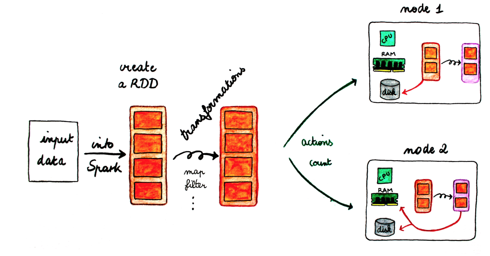
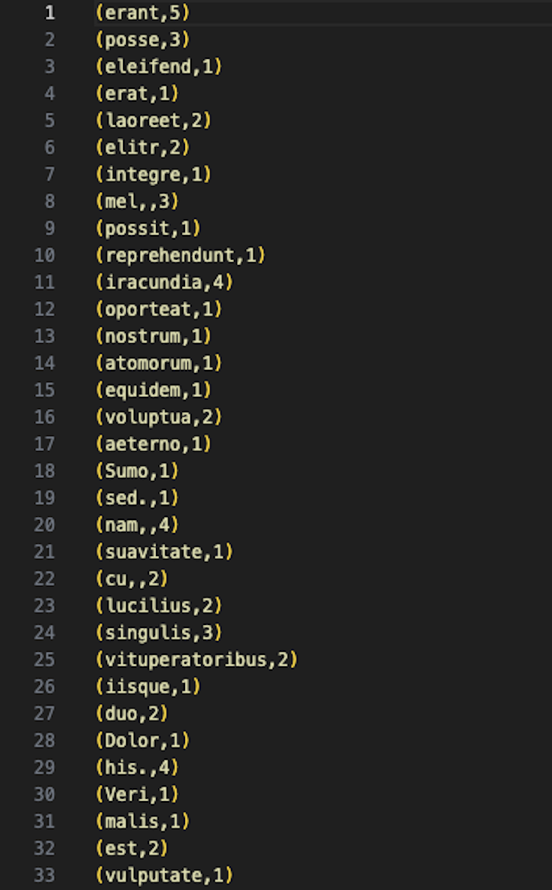

<center></center>


## Objectifs
Utilisation de Spark pour lancer un traitement par lot sur un fichier sur HDFS. 


## Préparation de l'environnement et Code
Nous allons dans cette partie créer un projet Spark Batch en Java (un simple WordCount), le charger sur le cluster et lancer le job.

  1. Créer un projet Maven avec IntelliJ intitulé _2-Spark-Batch_, en utilisant la config suivante:
    - **GroupId**: spark.mapreduce
    - **ArtifactId**: wordcount-spark
    - **Version**: 1
  2. Rajouter dans le fichier pom les dépendances nécessaires, et indiquer la version du compilateur Java:
  ```xml
  <properties>
      <maven.compiler.source>1.8</maven.compiler.source>
      <maven.compiler.target>1.8</maven.compiler.target>
  </properties>
  <dependencies>
      <dependency>
          <groupId>org.apache.spark</groupId>
          <artifactId>spark-core_2.13</artifactId>
          <version>3.5.0</version>
      </dependency>
      <dependency>
          <groupId>org.slf4j</groupId>
          <artifactId>slf4j-reload4j</artifactId>
          <version>2.1.0-alpha1</version>
          <scope>test</scope>
      </dependency>
  </dependencies>
  ```
  3. Sous le répertoire java, créer un package que vous appellerez _spark.batch_, et dedans, une classe appelée _WordCountTask_.
  4. Écrire le code suivant dans _WordCountTask.java_ :
  ```java
  package spark.batch;

  import org.apache.spark.SparkConf;
  import org.apache.spark.api.java.JavaPairRDD;
  import org.apache.spark.api.java.JavaRDD;
  import org.apache.spark.api.java.JavaSparkContext;
  import org.slf4j.Logger;
  import org.slf4j.LoggerFactory;
  import scala.Tuple2;

  import java.util.Arrays;
  import com.google.common.base.Preconditions;

  public class WordCountTask {
        private static final Logger LOGGER = LoggerFactory.getLogger(WordCountTask.class);

        public static void main(String[] args) {
            Preconditions.checkArgument(args.length > 1, "Please provide the path of input file and output dir as parameters.");
            new WordCountTask().run(args[0], args[1]);
        }

        public void run(String inputFilePath, String outputDir) {
            String master = "local[*]";
            SparkConf conf = new SparkConf()
                    .setAppName(WordCountTask.class.getName())
                    .setMaster(master);
            JavaSparkContext sc = new JavaSparkContext(conf);

            JavaRDD<String> textFile = sc.textFile(inputFilePath);
            JavaPairRDD<String, Integer> counts = textFile
                    .flatMap(s -> Arrays.asList(s.split(" ")).iterator())
                    .mapToPair(word -> new Tuple2<>(word, 1))
                    .reduceByKey((a, b) -> a + b);
            counts.saveAsTextFile(outputDir);
        }
    }
  ```
  La première chose à faire dans un programme Spark est de créer un objet _JavaSparkContext_, qui indique à Spark comment accéder à un cluster. Pour créer ce contexte, vous aurez besoin de construire un objet _SparkConf_ qui contient toutes les informations sur l'application.

    * _appName_ est le nom de l'application
    * _master_ est une URL d'un cluster Spark, Mesos ou YARN, ou bien une chaîne spéciale _local_ pour lancer le job en mode local.

!!! warning
      Nous avons indiqué ici que notre master est _local_ pour les besoins du test, mais plus tard, en le packageant pour le cluster, nous allons enlever cette indication. Il est en effet déconseillé de la hard-coder dans le programme, il faudrait plutôt l'indiquer comme option de commande à chaque fois que nous lançons le job.

    Le reste du code de l'application est la version en Java de l'exemple en scala que nous avions fait avec [spark-shell](../tp3).

## Test du code en local
Pour tester le code sur votre machine, procéder aux étapes suivantes:

  1. Insérer un fichier texte de votre choix (par exemple le fameux [loremipsum.txt](https://generator.lorem-ipsum.info/)) dans le répertoire src/main/resources.
  2. Lancer le programme en utilisant les arguments suivants:
     1. **Arg1**:  le chemin du fichier _loremipsum.txt_
     2. **Arg2**: le chemin d'un répertoire _out_ sous _resources_ (vous ne devez pas le créer)
  1. Cliquer sur OK, et lancer la configuration. Si tout se passe bien, un répertoire _out_ sera créé sous _resources_, qui contient (entre autres) deux fichiers: part-00000, part-00001.

<center></center>

## Lancement du code sur le cluster
Pour exécuter le code sur le cluster, modifier comme indiqué les lignes en jaune dans ce qui suit:

```java hl_lines="11 12 18"
public class WordCountTask {
  private static final Logger LOGGER = LoggerFactory.getLogger(WordCountTask.class);

  public static void main(String[] args) {
      Preconditions.checkArgument(args.length > 1, "Please provide the path of input file and output dir as parameters.");
      new WordCountTask().run(args[0], args[1]);
  }

  public void run(String inputFilePath, String outputDir) {

      SparkConf conf = new SparkConf()
              .setAppName(WordCountTask.class.getName());

      JavaSparkContext sc = new JavaSparkContext(conf);

      JavaRDD<String> textFile = sc.textFile(inputFilePath);
      JavaPairRDD<String, Integer> counts = textFile
              .flatMap(s -> Arrays.asList(s.split("\t")).iterator())
              .mapToPair(word -> new Tuple2<>(word, 1))
              .reduceByKey((a, b) -> a + b);
      counts.saveAsTextFile(outputDir);
  }
}
```

Lancer ensuite une configuration de type Maven, avec la commande _package_. Un fichier intitulé _wordcount-spark-1.jar_ sera créé sous le répertoire target.

Nous allons maintenant copier ce fichier dans docker. Pour cela, naviguer vers le répertoire du projet avec votre terminal (ou plus simplement utiliser le terminal dans VSCode), et taper la commande suivante:

```Bash
docker cp target/wordcount-spark-1.jar hadoop-master:/root/wordcount-spark.jar
```

Revenir à votre contenaire master, et lancer un job Spark en utilisant ce fichier jar généré, avec la commande ```spark-submit```, un script utilisé pour lancer des applications spark sur un cluster.

```Bash
spark-submit  --class spark.batch.WordCountTask --master local wordcount-spark.jar input/purchases.txt out-spark
```

  * Nous allons lancer le job en mode local, pour commencer.
  * Le fichier en entrée est le fichier purchases.txt (que vous déjà chargé dans HDFS dans le TP précédent), et le résultat sera stocké dans un nouveau répertoire _out-spark_.

!!!warning "Attention"
      Vérifiez bien que le fichier _purchases_ existe dans le répertoire input de HDFS (et que le répertoire _out-spark_ n'existe pas)!
      Si ce n'est pas le cas, vous pouvez le charger avec les commandes suivantes:
      ```
      hdfs dfs -mkdir -p input
      hdfs dfs -put purchases.txt input
      ```

Si tout se passe bien, vous devriez trouver, dans le répertoire _out-spark_, deux fichiers part-00000 et part-00001, qui ressemblent à ce qui suit:

<center></center>

Nous allons maintenant tester le comportement de _spark-submit_ si on l'exécute en mode _cluster_ sur YARN. Pour cela, exécuter le code suivant:
```Bash
spark-submit  --class spark.batch.WordCountTask --master yarn --deploy-mode cluster wordcount-spark.jar input/purchases.txt out-spark2
```

  * En lançant le job sur Yarn, deux modes de déploiement sont possibles:
    - **Mode cluster**: où tout le job s'exécute dans le cluster, c'est à dire les Spark Executors (qui exécutent les vraies tâches) et le Spark Driver (qui ordonnance les Executors). Ce dernier sera encapsulé dans un YARN Application Master.
    - **Mode client** : où Spark Driver s'exécute sur la machine cliente (tel que votre propre ordinateur portable). Si votre machine s'éteint, le job s'arrête. Ce mode est approprié pour les jobs interactifs.

Si tout se passe bien, vous devriez obtenir un répertoire out-spark2 dans HDFS avec les fichiers usuels.

???bug "En cas d'erreur: consulter les logs!"
      En cas d'erreur ou d'interruption du job sur Yarn, vous pourrez consulter les fichiers logs pour chercher le message d'erreur (le message affiché sur la console n'est pas assez explicite). Pour cela, sur votre navigateur, aller à l'adresse: ```http://localhost:8041/logs/userlogs```et suivez toujours les derniers liens jusqu'à _stderr_.

