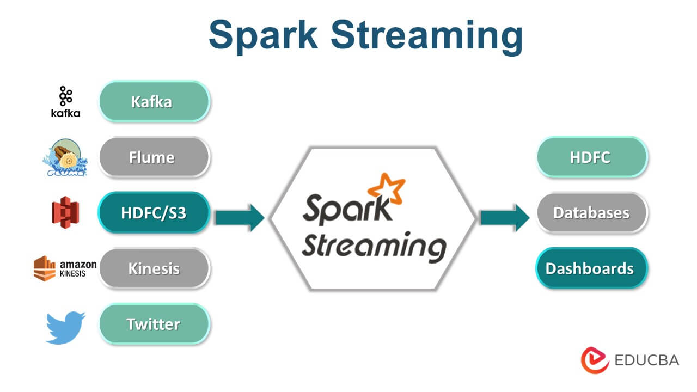

<center></center>


## Objectifs
Utilisation de Spark pour faire un traitement en streaming sur des données saisies au fur et à mesure sur le clavier. 

## Spark Streaming

Spark est connu pour supporter également le traitement des données en streaming. Les données peuvent être lues à partir de plusieurs sources tel que Kafka, Flume, Kinesis ou des sockets TCP, et peuvent être traitées en utilisant des algorithmes complexes. Ensuite, les données traitées peuvent être stockées sur des systèmes de fichiers, des bases de données ou des dashboards. Il est même possible de réaliser des algorithmes de machine learning et de traitement de graphes sur les flux de données.

<center></center>

En interne, il fonctionne comme suit: Spark Streaming reçoit des données en streaming et les divise en micro-batches, qui sont ensuite traités par le moteur de spark pour générer le flux final de résultats.

<center></center>

## Environnement et Code
Nous allons commencer par tester le streaming en local, comme d'habitude. Pour cela:

  1. Commencer par créer un nouveau projet Maven appelé _3-Spark-Streaming_, avec le fichier pom suivant:
  ```xml
  <?xml version="1.0" encoding="UTF-8"?>
  <project xmlns="http://maven.apache.org/POM/4.0.0"
         xmlns:xsi="http://www.w3.org/2001/XMLSchema-instance"
         xsi:schemaLocation="http://maven.apache.org/POM/4.0.0 http://maven.apache.org/xsd/maven-4.0.0.xsd">
    <modelVersion>4.0.0</modelVersion>

    <groupId>spark.streaming</groupId>
    <artifactId>stream</artifactId>
    <version>1</version>

    <properties>
        <maven.compiler.source>1.8</maven.compiler.source>
        <maven.compiler.target>1.8</maven.compiler.target>
    </properties>

    <dependencies>
        <dependency>
            <groupId>org.apache.spark</groupId>
            <artifactId>spark-core_2.13</artifactId>
            <version>3.5.0</version>
        </dependency>
        <dependency>
          <groupId>org.apache.spark</groupId>
          <artifactId>spark-streaming_2.13</artifactId>
          <version>3.5.0</version>
      </dependency>
      <dependency>
            <groupId>org.apache.spark</groupId>
            <artifactId>spark-sql_2.13</artifactId>
            <version>3.5.0</version>
            <scope>provided</scope>
        </dependency>

    </dependencies>
  </project>
  ```
  2. Créer une classe _spark.streaming.Stream_ avec le code suivant:

  ```java
  package spark.streaming;

  import org.apache.spark.sql.Dataset;
  import org.apache.spark.sql.Encoders;
  import org.apache.spark.sql.SparkSession;
  import org.apache.spark.sql.streaming.StreamingQuery;
  import org.apache.spark.sql.streaming.StreamingQueryException;
  import org.apache.spark.sql.streaming.Trigger;

  import java.util.concurrent.TimeoutException;
  import java.util.Arrays;

  public class Stream {
      public static void main(String[] args) throws StreamingQueryException, TimeoutException  {
          SparkSession spark = SparkSession
              .builder()
              .appName("NetworkWordCount")
              .master("local[*]")
              .getOrCreate();

          // Créer un DataFrame représentant le flux de lignes d'entrée de la connexion à localhost:9999
          Dataset<String> lines = spark
              .readStream()
              .format("socket")
              .option("host", "localhost")
              .option("port", 9999)
              .load()
              .as(Encoders.STRING());

          // Diviser les lignes en mots
          Dataset<String> words = lines.flatMap(
              (String x) -> Arrays.asList(x.split(" ")).iterator(),
              Encoders.STRING());

          // Compter le nombre de fois chaque mot a été trouvé
          Dataset<org.apache.spark.sql.Row> wordCounts = words.groupBy("value").count();

          // Lancer l'exécution de la requête qui imprime les calculs en cours d'exécution sur la console
          StreamingQuery query = wordCounts.writeStream()
              .outputMode("complete")
              .format("console")
              .trigger(Trigger.ProcessingTime("1 second"))
              .start();

          query.awaitTermination();
      }
  }
  ```

  Ce code permet de calculer le nombre de mots dans un stream de données (provenant du port localhost:9999) chaque seconde. Dans sa version actuelle, Spark encourage l'utilisation de _Structured Streaming_, une API de haut niveau qui fournit un traitement plus efficace, et qui est construite au dessus de Spark SQL, en intégrant les structures DataFrame et Dataset.


???info "Trigger Interval"
    Dans Spark Structured Streaming, le concept de microbatch est utilisé pour traiter les données en continu par petits lots incrémentaux. La durée de chaque micro-lot est configurable et détermine la fréquence de traitement des données en continu. Cette durée est appelée "intervalle de déclenchement".
    Si vous ne spécifiez pas explicitement d'intervalle de déclenchement, le trigger par défaut est _ProcessingTime(0)_, qui est aussi connu comme le mode de traitement par micro-lots. Ce paramètre par défaut signifie que Spark essaiera de traiter les données aussi rapidement que possible, sans délai fixe entre les micro-lots.


## Lancement du code sur le cluster

Nous allons directement lancer le code sur le cluster, car nous allons utiliser une petite commande utilitaire qui se trouve dans la majorité des systèmes Unix-like: `netcat`.
  
  * Générer le fichier jar.
  * Copier le fichier jar sur le contenaire master. On l'appellera `stream-1.jar`
  * Installer la commande netcat sur le contenaire master comme suit:
    * D'abord, faire un update de la liste ds packages sur votre contenaire:
    ```bash
    apt update
    ```
    * Ensuite, installer netcat:
    ```bash
    apt install netcat
    ```
  * Ouvrir un nouveau terminal sur votre contenaire master, et taper la commande suivante pour créer le stream:
    ```Bash
      nc -lk 9999
    ```
  * Revenez au premier terminal pour lancer votre fichier Jar. L'application sera en écoute sur localhost:9999.
    ```bash
    spark-submit  --class spark.streaming.Stream --master local stream-1.jar > out
    ```
  * Commencer à écrire des messages sur la console de votre terminal (là où vous avez lancé la commande nc)

Nous avons utilisé à la fin de la commande spark-submit la chaîne `> out`, pour indiquer que la sortie de la commande sera enregistrée dans un fichier out. 
Une fois que vous aurez saisi le texte à tester, arrêter l'application (avec Ctrl-C), et afficher le contenu du fichier _out_. Vous trouverez normalement un résultat semblable au suivant:

<center></center>